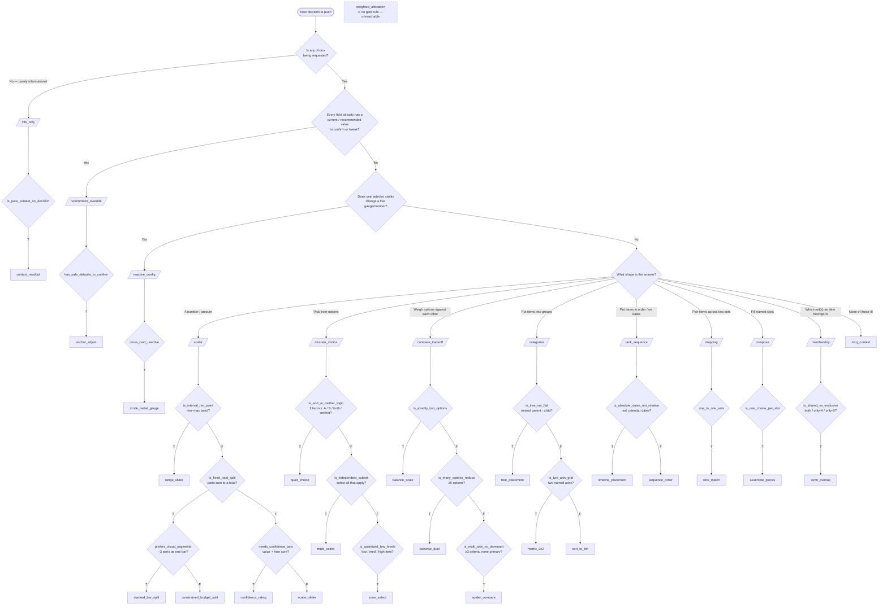

# Card-type decision tree

Which of the 24 Decision HUD card types to use, as a flowchart. Derived
directly from the gate's rule table (`_CARD_TYPE_RULES` in
`backend-plugin/db.py`, mirrored from card-type-gate's
`card_type_selector.py`) and the frontend renderer map (`CARD_RENDERERS`
in `plugin.js`). Where this doc and the code disagree, the code wins.

The 24 = the gate's 23 types plus `weighted_allocation`, which has a
renderer but no gate rule (see [Gaps](#gaps)).

## How to read it

Two steps, same as the gate:

1. **Pick the bucket** — what shape is the answer? (top of the chart)
2. **Answer the bucket's discriminants** — each diamond below the bucket
   is one `card_type_answers` key. Every discriminant must be answered;
   pass `card_type_bucket` + `card_type_answers` with the push.

Bucket questions are ordered so the first "yes" wins: check "is there a
decision at all?" and "are there defaults to confirm?" before looking at
answer shape.

## Flowchart

A diamond with no `F` arrow is a dead end: answering `F` there gives
`no_match`, which means the gate rejects the claimed `card_type`. Push with
`card_type=None` (the plain button list — usually the right answer for
"pick exactly one of N") or re-bucket as `none_of_these` → `mcq_context`.

## Quick reference

| # | card_type | bucket | Use when… |
|---|---|---|---|
| 1 | `context_readout` | info_only | Nothing to decide — just show state/context |
| 2 | `anchor_adjust` | recommend_override | Every field has a recommended value; user confirms or nudges |
| 3 | `mode_radial_gauge` | reactive_config | Picking a mode visibly moves a live gauge/number |
| 4 | `range_slider` | scalar | Answer is a min–max band, not one number |
| 5 | `stacked_bar_split` | scalar | Parts sum to a fixed total, ~3 parts shown as one bar |
| 6 | `constrained_budget_split` | scalar | Parts sum to a fixed total, shown as separate sliders (>3 parts) |
| 7 | `confidence_rating` | scalar | One value **plus** "how sure are you?" |
| 8 | `scalar_slider` | scalar | One number / setting, nothing else |
| 9 | `quad_choice` | discrete_choice | Two factors combined: A, B, both, or neither |
| 10 | `multi_select` | discrete_choice | "Select all that apply" |
| 11 | `zone_select` | discrete_choice | One of a few exclusive ordered tiers (low/med/high) |
| 12 | `balance_scale` | compare_tradeoff | Exactly two alternatives weighed against each other |
| 13 | `pairwise_duel` | compare_tradeoff | ≥5 options to whittle down head-to-head |
| 14 | `spider_compare` | compare_tradeoff | 3–4 options across ≥3 criteria, none dominant |
| 15 | `tree_placement` | categorize | Items go into nested categories |
| 16 | `matrix_2x2` | categorize | Items placed on two independent axes (impact × effort) |
| 17 | `sort_to_bin` | categorize | Items go into flat buckets |
| 18 | `timeline_placement` | rank_sequence | Items land on real calendar dates |
| 19 | `sequence_order` | rank_sequence | Items put in relative order (first → last) |
| 20 | `wire_match` | mapping | Pair each item in set A with one in set B |
| 21 | `assemble_pieces` | compose | Named slots, each with its own option list |
| 22 | `venn_overlap` | membership | Two sets — which items are shared vs exclusive |
| 23 | `mcq_context` | none_of_these | Nothing above fits; multiple choice with context |
| 24 | `weighted_allocation` | — | ⚠ Renderer exists, no gate rule (see Gaps) |

## Gaps

Found while building this tree; not fixed here.

- **`weighted_allocation` is unreachable.** It is in `CARD_RENDERERS` but
  not in `_CARD_TYPE_RULES`, so `_verify_card_type` rejects any push that
  claims it. It overlaps `constrained_budget_split` (both = weights summing
  to a total); `CARD_TYPE_GATE_AMBIGUITY_RESOLUTION.md` already flags it as
  confusable. Either add a discriminant that separates it or delete the
  renderer.
- **`mcq_context` has no dedicated renderer.** It falls through to
  `DefaultChoiceCard`.
- **Gaps in the tree that route to `no_match`:** plain "pick exactly one
  of N" in `discrete_choice` (all three discriminants false), and
  `compare_tradeoff` with 3–4 options and one dominant criterion. Both
  fall back to the plain list.
